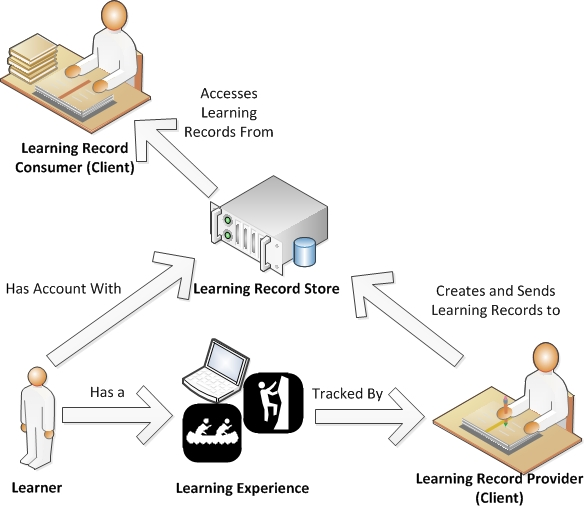

# Experience API
## Advanced Distributed Learning (ADL) Co-Laboratories

>#### License

>"Copyright 2013 Advanced Distributed Learning (ADL) Initiative, U.S. Department of Defense

>Licensed under the Apache License, Version 2.0 (the "License"). You may not use this file except 
>in compliance with the License. You may obtain a copy of the License at
>http://www.apache.org/licenses/LICENSE-2.0

>Unless required by applicable law or agreed to in writing, software distributed under the License 
>is distributed on an "AS IS" BASIS, WITHOUT WARRANTIES OR CONDITIONS OF ANY KIND, either express 
>or implied. See the License for the specific language governing permissions and limitations under 
>the License."

>This document was authored by members of the Experience API Working Group (see 
>list in [CONTRIBUTING.md](CONTRIBUTING.md#contributors)) in support of the Office of the Deputy Assistant Secretary of 
>Defense (Readiness) Advanced Distributed Learning (ADL) Initiative. Please 
>send all feedback and inquiries to helpdesk@adlnet.gov  

## Table of Contents
*	Part One:	[About the Experience API](./xAPI-About.md#part-one-about-the-experience-api)  
	*	1.0.	[Introduction](./xAPI-About.md#10-introduction) 
	*	2.0.	[How To Use This Document](./xAPI-About.md#20-how-to-use-this-document)  
		*	2.1.	[MUST / SHOULD / MAY](./xAPI-About.md#21-must--should--may)  
	 	*	2.2.	[Guidelines for Interpreting Descriptive Text and Tables](./xAPI-About.md#22-guidelines-for-interpreting-descriptive-text-and-tables)  
	*	3.0.	[Serialization and JavaScript Object Notation](./xAPI-About.md#30-serialization-and-javascript-object-notation-json)
	*	4.0.	[Definitions](./xAPI-About.md#40-definitions) 
	*	5.0.	[xAPI Components](./xAPI-About.md#50-xapi-components) 
	*	6.0.	[Extending xAPI](./xAPI-About.md#60-extending-xapi) 
	*	7.0.	[Profiles and Communities of Practice](./xAPI-About.md#70-profiles-vocabularies-and-communities-of-practice)  
	*	[Appendices](./xAPI-About.md#appendices)  
		*	[Appendix A: Revision History](./xAPI-About.md#appendix-a-revision-history)  
		*	[Appendix B: cmi5 Example](./xAPI-About.md#appendix-b-cmi5-example)  
*	Part Two:	[Experience API Data](./xAPI-Data.md#part-two-experience-api-data)  
	*	1.0.	[Documents](./xAPI-Data.md#10-documents) 
	*	2.0.	[Statements](./xAPI-Data.md#20-statements)  
		*	2.1.	[Purpose](./xAPI-Data.md#21-purpose)  
	 	*	2.2.	[Formatting Requirements](./xAPI-Data.md#22-formatting-requirements) 
	 	*	2.3.	[Statement Lifecycle](./xAPI-Data.md#23-statement-lifecycle) 
		 	*	2.3.1.	[Statement Immutability](./xAPI-Data.md#231-statement-immutability) 
		 	*	2.3.2.	[Voiding](./xAPI-Data.md#232-voiding) 
   		*	2.4.	[Statement Properties](./xAPI-Data.md#24-statement-properties)  
	        *	2.4.1.	[ID](./xAPI-Data.md#241-id)  
	        *	2.4.2.	[Actor](./xAPI-Data.md#242-actor)  
	        *	2.4.3.	[Verb](./xAPI-Data.md#243-verb)  
	        *	2.4.4.	[Object](./xAPI-Data.md#244-object)  
	        *	2.4.5.	[Result](./xAPI-Data.md#245-result)  
	        *	2.4.6.	[Context](./xAPI-Data.md#246-context)  
	        *	2.4.7.	[Timestamp](./xAPI-Data.md#247-timestamp)  
	        *	2.4.8.	[Stored](./xAPI-Data.md#248-stored)  
	        *	2.4.9.	[Authority](./xAPI-Data.md#249-authority)  
	        *	2.4.10.	[Version](./xAPI-Data.md#2410-version)  
	        *	2.4.11.	[Attachments](./xAPI-Data.md#2411-attachments)  
    	*	2.5.	[Retrieval of Statements](./xAPI-Data.md#25-retrieval-of-statements)   
    	*	2.6.	[Signed Statements](./xAPI-Data.md#26-signed-statements)  
	*	3.0.	[Metadata](./xAPI-Data.md#30-metadata)
		*	3.1.	[IRI Requirements](./xAPI-Data.md#31-iri-requirements)  
		*	3.2.	[Hosted Metadata](./xAPI-Data.md#32-hosted-metadata)  
    *	4.0.	[Special Data Types and Rules](./xAPI-Data.md#40-special-data-types-and-rules)  
		*	4.1.	[Extensions](./xAPI-Data.md#41-extensions) 
		*	4.2.	[Language Maps](./xAPI-Data.md#42-language-maps)
		*	4.3.	[IRIs](./xAPI-Data.md#43-iris)
		*	4.4.	[UUIDs](./xAPI-Data.md#44-uuids)
		*	4.5.	[ISO 8601 Timestamps](./xAPI-Data.md#45-iso-8601-timestamps)
		*	4.6.	[ISO 8601 Durations](./xAPI-Data.md#46-iso-8601-durations)
	*	[Appendices](./xAPI-Data.md#appendices)  
		*	[Appendix A: Example Statements](./xAPI-Data.md#appendix-a-example-statements)  
		*	[Appendix B: Example statement objects of different types](./xAPI-Data.md#appendix-b-examples-of-statements-objects-of-different-types)  
		*	[Appendix C: Example definitions for Activities of type "cmi.interaction"](./xAPI-Data.md#appendix-c-example-definitions-for-activities-of-type-cmiinteraction)  	
		*	[Appendix D: Example Signed Statement](./xAPI-Data.md#appendix-d-example-signed-statement)  
*	Part Three:	[Data Processing, Validation, and Security](./xAPI-Communication.md#part-three-data-processing-validation-and-security)  
	*	1.0.	[Requests](./xAPI-Communication.md#10-requests)
		*	1.1.	[HEAD Request Implementation](./xAPI-Communication.md#11-head-request-implementation)  
	 	*	1.2.	[Headers](./xAPI-Communication.md#12-headers) 
	 	*	1.3.	[Alternate Request Syntax](./xAPI-Communication.md#13-alternate-request-syntax) 
	 	*	1.4.	[Encoding](./xAPI-Communication.md#14-encoding) 
	 	*	1.5.	[Content Types](./xAPI-Communication.md#15-content-types) 
	        *	1.5.1.	[Application/JSON](./xAPI-Communication.md#151-applicationjson) 
	        *	1.5.2.	[Multipart/Mixed](./xAPI-Communication.md#152-multipartmixed)
	*	2.0.	[Resources](./xAPI-Communication.md#20-resources)   
	 	*	2.1.	[Statement Resource](./xAPI-Communication.md#21-statement-resource) 
	 	*	2.2.	[Documents Resources](./xAPI-Communication.md#doctransfer) 
	 	*	2.3.	[State Resource](./xAPI-Communication.md#23-state-resource) 
	 	*	2.4.	[Agents Resource](./xAPI-Communication.md#24-agents-resource) 
	 	*	2.5.	[Activities Resource](./xAPI-Communication.md#25-activities-resource) 
	 	*	2.6.	[Agent Profile Resource](./xAPI-Communication.md#26-agent-profile-resource) 
	 	*	2.7.	[Activity Profile Resource](./xAPI-Communication.md#27-activity-profile-resource) 
	 	*	2.8.	[About Resource](./xAPI-Communication.md#28-about-resource) 
   	*	3.0.	[Data Validation](./xAPI-Communication.md#30-data-validation)     
    	*	3.1.	[Concurrency](./xAPI-Communication.md#31-concurrency)  
    	*	3.2.	[Error Codes](./xAPI-Communication.md#32-error-codes)
    	*	3.3     [Versioning](./xAPI-Communication.md#33-versioning)  
    *	4.0.	[Authentication](./xAPI-Communication.md#40-authentication)  
		*	4.1.	[OAuth 1.0 Authentication Scenarios and Methods](./xAPI-Communication.md#41-oauth-10-authentication-scenarios-and-methods) 
		*	4.2.	[OAuth 1.0 Authorization Scope](./xAPI-Communication.md#42-oauth-10-authorization-scope)
    *	5.0	[Security](./xAPI-Communication.md#50-security)
	*	[Appendices](./xAPI-Communication.md#appendices)  
		*	[Appendix A: Converting Statements to 1.0.0](./xAPI-Communication.md#appendix-a-converting-statements-to-100)  
		*	[Appendix B: Table of All Resources](./xAPI-Communication.md#appendix-b-table-of-all-resources)  
		*	[Appendix C: Cross Domain Request Example](./xAPI-Communication.md#appendix-c-cross-domain-request-example)  

# Part One: About the Experience API

## 1.0 Introduction

The Experience API (xAPI) is a technical specification that aims to facilitate the documentation and communication of 
learning experiences. It specifies a structure to describe learning experiences and defines how these descriptions can 
be exchanged electronically.  

The xAPI is an effort of the Advanced Distributed Learning (ADL) Initiative.  ADL was established in 1997 to 
standardize and modernize training and education management and delivery in the US. Since that time, there has been a 
growing realization of the need to track learning experiences of individuals beyond formal, structured computer-based training. 
In assessing candidates' suitability for positions or their capability for performing various tasks, there is a need 
to consider a wide range of formal and informal learning experiences, both on and offline.  That information, 
more often than not is scattered across a wide variety of sources.

Out of this perceived need, the xAPI community and specification were born. xAPI assumes that:
  * There is a need to be able to analyze information about learning experiences and their outcomes distributed across 
  a wide variety of sources, platforms and technologies.
  * Developing a commonly-accepted framework for gathering, storing and exchanging this information represents the 
  best way of achieving this.

The goals of the xAPI are:

* To make it easier to understand and compare learning experiences and their outcomes recorded across a wide 
variety of contexts, platforms and technologies.
* To maximize interoperability of services which create, gather, store and process information about learning experiences.
* To provide a guide to those who want to build applications that conform to and implement this specification.
* To provide criteria against which conformance to this specification can be tested.

The document that follows sets out the xAPI specification which is designed to achieve these goals. 

## 2.0 How to Use This Document

This is a definitive document which describes how the Experience API is to be implemented.
It is a technical document authored specifically for individuals and organizations implementing this 
technology with the intent of such individuals developing interoperable tools, systems and services that 
are independent of each other and interoperable with each other. 

Whenever possible, the language and formatting used in this document is intended to be 
_considerate_ of non-technical readers because various tools, systems and services 
are based on the specification set described below. For this reason, sections that provide a 
_high-level overview_ of a given facet of the Experience API are labeled **description** or 
**rationale**. Items in this document labeled as **requirements**, **details** or **examples** are more technical.

This specification is split into three parts. Part one is this introduction. It offers some background, 
high-level summaries and direction on how to read the rest of the specification. 

Part two of this specification defines a data model for various data objects that are used in this specification. 
The most significant object within the xAPI data model is the "Statement" object. This specification defines the properties 
of the Statement object (including "Actor", "Verb", "Object", "Result", and "Context") and the rules of syntax for the 
values of those properties and how they are represented. This part helps to ensure that services implementing the 
specification follow a consistent data structure.

Part three of this specification sets out the transfer methods that must be used when communicating 
information about learning experiences between services that adhere to the specification. This includes the format 
of requests and the expected responses. Note that communication in xAPI is not restricted to a "Learning Record Store" (LRS) 
receiving data from "content". LRSs can communicate with services ranging from "Learning Record Providers" to 
"Learning Record Consumers" to other LRSs. xAPI follows the guidelines of the REST software architecture style, and as such 
data is transferred via HTTP requests and responses. Part three also defines security methods allowing for the trusted 
exchange of information between the LRS and trusted "Clients".

### 2.1 MUST / SHOULD / MAY 
There are three levels of obligation with regards to conformance to the xAPI specification identified by the terms 
MUST, SHOULD and MAY. A service or system that fails to implement a MUST (or a MUST NOT) requirement is non-conformant. 
Failing to meet a SHOULD requirement is not a violation of conformity, but goes against the recommendations of the specification. 
MAY indicates an option, to be decided by the developer with no consequences for conformity. Usage 
of these terms outside of requirement language does not designate a requirement and is avoided whenever possible. 
Complete definitions of MUST, SHOULD, MAY, MUST NOT and SHOULD NOT are found in [RFC 2119](https://www.ietf.org/rfc/rfc2119.txt).

The use of an asterisk* following SHOULD indicates a very strong recommendation. It is planned that these 
recommendations will become MUST requirements in a future version. Not following these recommendations could 
risk interoperability and and/or lead to various other issues depending on the specifics of the recommendation. 
These recommendations cannot be MUST requirements within this version as these would be breaking changes. 
The xAPI Working Group strongly encourages adopters to implement these requirements as though they were MUST 
requirements, while continuing to support other adopters that might not do so.

### 2.2 Guidelines for Interpreting Descriptive Text and Tables
As a rule of thumb, if the guideline appears technical or seems to be a requirement, interpret it 
as such. This is especially true of longer, more, detailed explanations and of tables, each of which would 
be unintuitive and/or lengthy to dissect into a list of requirements.

Tables are used throughout this specification to define requirements for lists of properties, parameters, etc.
The tables define which properties are required, recommended and optional. Generally, the notion of "optional" relates to 
the service creating the object, while services receiving and interpreting the object need to be able to interpret all 
properties of that object. Often, properties are optional because the data may not be relevant in every context; 
if the data is relevant in a particular context, then it is expected the property will be populated.

If an optional property or parameter contains an object with properties that are recommended or required, then 
these properties are only recommended/required if the property or parameter containing them is used.

Examples are provided throughout the specification and in appendices to illustrate implementation. The content of these 
examples is fictional in order to illustrate the requirements of the specification and may not always 
illustrate the best practice approach to tracking the particular learning experience used in the example. Examples 
can be used to inform interpretation of requirements, but are not intended to take precedence over requirements. 

Where the specification does not include requirements relating to a particular facet of implementation, 
that detail can be considered to be outside of the scope of this specification. It is up to the implementer 
to determine a sensible approach. This specification tries to avoid vagueness and will usually give a rationale 
even if there no requirement in a given area.

## 3.0 Serialization and JavaScript Object Notation (JSON)

Serialization is the process of translating data objects and structures into a format for storage or transmission, such that the 
original data object can be recreated from the resulting serialization. In some cases it might be possible to serialize a piece 
of data in more than one way. For example, a boolean property with a value corresponding to true might be represented 
as `true` or `1` depending on the serialization used. 

xAPI follows the rules of JSON for serializations (so boolean values are represented as `true` or `false`). It might 
also be possible to represent the objects defined in this specification using other serializations, such as XML. This is out 
of scope of this specification and use of anything other than JSON to represent the objects defined in this specification 
is not conformant. 

Even within the rules of JSON there are possible variations of how data can be serialized, especially in relation to data 
about time. This is significant as a number of features of xAPI rely on systems being able to determine whether two 
Statements are equivalent. See [Immutability and exceptions](./xAPI-Data.md#231-statement-immutability) 
for more details about the properties of the Statement affected by this. 

JSON allows for objects to have properties that contain empty objects. This is not recommended within xAPI; if the Statement 
is not intended to contain data about a property then it is expected that the property will not be used at all. 
All required properties are required to contain values. 


## 4.0 Definitions  

* [Activity](#def-activity)
* [Activity Provider (AP)](#def-activity-provider)
* [Actor](#def-actor)
* [Application Programming Interface (API)](#def-api)
* [Authentication](#def-authentication)
* [Authorization](#def-authorization)
* [Community of Practice](#def-community-of-practice)
* [Document Profile Resource](#def-document-profile)
* [Endpoint](#def-endpoint)
* [Experience API (xAPI)](#def-experience-api)
* [Immutable](#def-immutable)
* [Internationalized Resource Identifier (IRI)](#def-iri)
* [Internationalized Resource Locator (IRL)](#def-irl)
* [Inverse Functional Identifier](#def-inverse-functional-identifier)
* [Learning Experience](#def-learning-experience)
* [Learning Management System (LMS)](#def-learning-management-system)
* [Learning Record](#def-learning-record)
* [Learning Record Consumer (LRC)](#def-learning-record-consumer)
* [Learning Record Provider (LRP)](#def-learning-record-provider)
* [Learning Record Store (LRS)](#def-learning-record-store)
* [Metadata Consumer](#def-metadata-consumer)
* [Metadata Provider](#def-metadata-provider)
* [Persona](#def-persona)
* [Profile](#def-profile)
* [Registration](#def-registration)
* [Representational State Transfer (REST)](#def-rest)
* [Service](#def-service)
* [Statement](#def-statement)
* [Tin Can API (TCAPI)](#def-tcapi)
* [Verb](#def-verb)
* [Vocabulary](#def-vocabulary)

<a name="def-activity"></a>

__Activity__: A type of Object making up the "this" in "I did this"; it is something 
with which an Actor interacted. It can be a unit of instruction, experience, or performance that is 
to be tracked in meaningful combination with a Verb. Interpretation of Activity is broad, meaning that 
Activities can even be tangible objects such as a chair (real or virtual). In the Statement "Anna 
tried a cake recipe", the recipe constitutes the Activity in terms of the xAPI Statement. Other 
examples of Activities include a book, an e-learning course, a hike, or a meeting.

<a name="def-activity-provider"></a>

__Activity Provider (AP)__: Now referred to as a Learning Record Provider. This change differentiates that 
the activity itself is not always the responsibility of software, rather just the tracking portion is. 

<a name="def-actor"></a>

__Actor__: An individual or group representation tracked using Statements performing an action within 
an Activity.  Is the "I" in "I did this".

<a name="def-api"></a>

__Application Programming Interface (API)__: A set of rules and standards created to allow access into 
a software application or tool.  

<a name="def-authentication"></a>

__Authentication__: The concept of verifying identity. Authentication allows interactions between two 
"trusted" parties.

<a name="def-authorization"></a>

__Authorization__: The affordance of permissions based on role; the process of making one party 
"trusted" by another.

<a name="def-client"></a>

__Client__: Refers to any entity that might interact through requests. Some examples could be a 
Learning Record Provider, a Learning Record Consumer, a Learning Record Store (LRS), or a Learning 
Management System (LMS).

<a name="def-community-of-practice"></a>

__Community of Practice (CoP)__: A group of practitioners connected by a common cause, role or purpose, which operates in a common 
modality. CoPs are focused on implementing xAPI within a specific knowledge domain or use case. CoPs or independent developers, 
can create domain-specific vocabularies, profiles, and recipes. These practices usually involve work around defining use cases 
and curating the various vocabulary terms, synonyms, and other related metadata that might be preferred within a CoP. They can 
also reuse existing vocabularies, profiles, and recipes already published by other CoPs or participants of the xAPI community.

<a name="def-document-profile"></a>

__Document Profile Resource__: A construct where information about the learner or activity is kept, typically in name/document pairs 
that have meaning to an instructional system component. Not to be confused with [Profile](#def-profile).

<a name="def-endpoint"></a>

__Endpoint__: An entry point in a service-oriented-architecture.  xAPI mirrors this approach with resources 
by defining the IRI from which communication takes place as an endpoint.

<a name="def-experience-api"></a>

__Experience API (xAPI)__: The collection of rules articulated in this document which determines how learning 
experiences are defined, formatted, and exchanged so that independent software programs can exchange and make 
use of this information.

<a name ="def-immutable"></a>

__Immutable__:  Adjective used to describe things which cannot be changed. With some exceptions, Statements in the xAPI 
are immutable. This ensures that when Statements are shared between LRSs, multiple copies of the Statement remain the same.

<a name="def-iri"></a>

__Internationalized Resource Identifier  (IRI)__: A unique identifier which could be an IRL. Used to identify an object 
such as a verb, activity or activity type. Unlike URIs, IRIs can contain some characters outside of the ASCII character 
set in order to support international languages. 

IRIs always include a scheme. This is not a requirement of this standard, but part of the definition of IRIs, per 
[RFC 3987](http://www.ietf.org/rfc/rfc3987.txt). What are sometimes called "relative IRIs" are not IRIs.

<a name="def-irl"></a>

__Internationalized Resource Locator (IRL)__:  In the context of this document, an IRL is an IRI that when translated 
into a URI (per the IRI to URI rules), is a URL. 

<a name="def-inverse-functional-identifier"></a>

__Inverse Functional Identifier__: An identifier which is unique to a particular persona or Group.

<a name="def-learning-experience"></a>

__Learning Experience__: An event associated with learning.  It is highly diverse as far as what it can be.  
Examples include reading a book, taking an online course, going on a field trip, engaging in self-directed 
research, or receiving a certificate for a completed course.

<a name="def-learning-management-system"></a>

__Learning Management System (LMS)__: "A software package used to administer one or more courses to one or more learners. 
An LMS is typically a web-based system that allows learners to authenticate themselves, register for courses, complete 
courses and take assessments" (Learning Systems Architecture Lab definition). An LMS in this document is used as an 
example of how a user is identified as "trusted" within a system and able to access its Learning Experiences.

<a name="def-learning-record"></a>

__Learning Record__: An account of a learning experience that is formatted according to the rules of xAPI.  A Learning Record
takes on many forms, including Statements, documents, and their parts.  This definition is intended to be all-inclusive.

<a name="def-learning-record-consumer"></a>

__Learning Record Consumer (LRC)__: An xAPI Client that accesses data from Learning Record Store(s) with the intent of processing 
the data, including interpretation, analysis, translation, dissemination, and aggregation.

<a name="def-learning-record-provider"></a>

__Learning Record Provider (LRP)__: An xAPI Client that sends data to Learning Record Store(s).  Often, the Learning Record 
Provider will create Learning Records while monitoring a learner as a part of a Learning Experience.

<a name="def-learning-record-store"></a>

__Learning Record Store (LRS)__: A server (i.e. system capable of receiving and processing web requests) that is responsible 
for receiving, storing, and providing access to Learning Records.

<a name="def-metadata-consumer"></a>

__Metadata Consumer__: A person, organization, software program or other thing that seeks to determine the meaning represented
by an IRI used within this specification and/or retrieves metadata about an IRI. An LRS might or might not be a metadata consumer. 

<a name="def-metadata-provider"></a>

__Metadata Provider__: A person, organization, software program or other thing that coins IRIs to be used within 
this specification and/or hosts metadata about an IRI. 

<a name="def-persona"></a>

__Persona__: A set of one or more representations which defines an Actor uniquely.  Conceptually, this is like 
having a "home email" and a "work email".  Both are the same person, but have different data, associations, etc.

<a name="def-profile"></a>

__Profile__: A specific set of rules and documentation for implementing xAPI in a particular context. Profiles generally provide a 
particular vocabulary of terms, some created specifically for the profile, and some are referenced from other vocabularies. 
Sometimes a profile might provide multiple vocabularies for different situations, and sometimes someone might curate a vocabulary 
from multiple sources without creating a profile.  Not to be confused with [Document Profile Resource](#def-document-profile).

<a name="def-registration"></a>

__Registration__: An instance of an Actor experiencing a particular Activity.

<a name="def-rest"></a>

__Representational State Transfer (REST)__: An architecture for designing networked web services.
It relies on HTTP methods and uses current web best practices.

<a name="def-service"></a>

__Service__: A software component responsible for one or more aspects of the distributed learning process. 
An LMS typically combines many services to design a complete learning experience.

<a name="def-statement"></a>

__Statement__: A data sctructure showing evidence for any sort of experience or event which is to be tracked 
in xAPI as a Learning Record.  A set of several Statements, each representing an event in time, might be used 
to track complete details about a learning experience.  

<a name="def-tcapi"></a>

__Tin Can API (TCAPI)__: The previous name of the API defined in this document, often used in 
informal references to the Experience API.  

<a name="def-verb"></a>

__Verb__: Is the action being done by the Actor within the Activity within a Statement. 
A Verb represents the "did" in "I did this".

<a name="def-vocabulary"></a>

__Vocabulary__: A list or collection of the terms that are used by a COP for labeling or categorizing information in a 
particular domain. The use of a vocabulary ensures that everyone is using the same word to mean the same thing. For more 
information on vocabularies, see the [xAPI Vocabulary Companion Specification](https://github.com/adlnet/companion-specification-for-xapi-vocabularies/blob/master/SUMMARY.md).


## 5.0 xAPI Components

This section explains and shows graphically how different pieces of xAPI can fit together.  

##### Tracking Experiences

###### Figure 1: Data Flow in xAPI


Figure 1 shows the tracking of learning experiences. A learner has a learning experience. This experience could take place in an 
online course, it could be on the job or it could be part of recreation. It really could be anything. This experience is tracked, 
on the learner’s behalf, by a trusted Learning Record Provider (LRP). The Learning Record Provider can also be responsible for the 
trusted relationship between the experience and the learner. This might even include launching content for the learner and 
managing digital rights associated with the content.  

The Learning Record Provider creates Learning Records and sends them to one or more Learning Record Stores (LRSs). The LRS stores
the Learning Records and makes them available to any authorized Client. A Learning Record Consumer (LRC) is a type of Client that accesses 
Learning Records and makes use of them.

##### Activity Data and Metadata

###### Figure 2: xAPI Activity Data and Metadata


Understanding how a single Activity (as uniquely identified by its IRI) is defined and described is a key concept in xAPI. 
Figure 2 shows this process. An Activity (as a part of a Statement) has metadata properties that may be populated within the 
Statement itself. This is done in the Statement's Activity Definition. The id of each Activity is an IRI which also could have 
metadata located at the resolution location of the IRI. Any metadata where the IRI resolves is under the control of the Metadata 
Provider. The Metadata Provider is also responsible for making sure the IRI is permanent and resolves correctly.

Any metadata located at where the IRI resolves is the authoritative source of metadata, and could be used to populate the LRS's 
canonical version of the Activity's metadata (LRS's Activity Definition) as a preference to what it receives from Statements. 
A Metadata Consumer can access metadata via the IRI for the authoritative version or can query the Activities Resource for the 
canonical version.

##### Agent and Persona Management

###### Figure 3: xAPI Agent and Persona Management


xAPI grants the framework for allowing selective access to one's personal data. This is done through the management of what are 
called personas. In xAPI, each persona represents the "I" in "I did this" and is logically the subject of the Statement. Each 
Agent or Group in xAPI corresponds to a persona. A learner sending Learning Records to an LRS could have multiple personas (Agents) 
associated with him or her. 

In Figure 3, a learner accesses multiple services. Some of these services are used at work, others at home.  Some are used for 
social purposes and others are used for educational or professional puproses.  Thus, there are multiple personas functioning 
collectively within these services.  Each of these services send data to the LRS. Afterwards, there are Statements from three 
different personas of the same learner. 

The LRS can aggregate all of the information of each of the personas into one "Person" Object. This object can be retrieved from 
The LRS via the [Agents Resource](./xAPI-Communication.md#24-agents-resource). How the LRS knows that these 
multiple personas belong to a single person is out of scope of this specification and there are several different approaches
that an LRS can take. It's also possible that some LRSs will have no mechanism for associating personas. 


## 6.0 Extending xAPI

xAPI can be extended in a few ways. The most notable are Statement extensions, which allow great flexibility within Statements. 
It is recommended that Communities of Practice agree on how to use extensions for their particular use cases and utilize 
profiles whenever possible. Implementation details are covered in [4.1 Extensions](./xAPI-Data.md#41-extensions).

The About Resource is another instance where xAPI supports extensions.  The LRS may find it useful to communicate features or 
behaviors beyond this specification. The LRS can use extensions to the About Resource to facilitate this communication.

Finally, the set of resources implemented is not expected to be constrained by this document. Resources beyond 
those listed in this specification can be implemented and co-exist with the resources defined in this specification.


## 7.0 Profiles, Vocabularies, and Communities of Practice

xAPI strictly defines the structure of Statements, but is very flexible as to the contents of that structure. For example, the 
specification requires that all Statements have a "verb" property, but does not restrict the values of that property; any Verb 
can be used. This flexibility enables xAPI to be used in any context, including future use cases not envisaged by the 
specification authors.

It is intended that [Communities of Practice (CoPs)](#def-community-of-practice) will define Verbs, Activity types, 
contextual relationships, extensions, etc. 
to be used in their profiles by providing unique identifiers wherever applicable. The CoP will define these identifiers and 
their metadata in a [Vocabulary](#def-vocabulary). A profile is a set of rules and vocabularies to implemented in addition to 
xAPI for the particular use case being addressed. It is very important that such communities exist and share best practices. 
For more information on publishing vocabularies, see the [Vocabulary Companion Specification](https://adl.gitbooks.io/companion-specification-for-xapi-vocabularies/content) and [Vocabulary Primer](https://adl.gitbooks.io/experience-xapi-vocabulary-primer/content/) documents.

It is recommended that a profile use a unique "category" within a Statement's context to refer to any Statement  
which implements the profile.  An example profile is [cmi5](https://github.com/AICC/CMI-5_Spec_Current), 
which is designed for the traditional single learner, single online learning use case.  An example cmi5 Statement can 
be found in [Appendix B: cmi5 Example](#appendix-b-cmi5-example).

CoPs are highly recommended to avoid duplication of effort, as creating too many ways to solve the same problem 
will cause fragmentation in similar domains and can potentially hurt interoperability.  An example of a CoP for the medical 
field is the [MedBiquitous Learning Experience Working Group](http://groups.medbiq.org/medbiq/display/XIG/Learning+Experience+Group+Home).


## Appendices

### Appendix A: Revision History
###### 0.8 (Project Tin Can API Deliverable) to 0.9 (March 31, 2012)  
  
Rustici Software, who delivered the Project Tin Can API, made modifications to the 
API prior to the April 2012 Kickoff Meeting. It was voted in this meeting to 
move those changes into the current specification and revision to 0.9.

###### 0.90 to 0.95 (August 31, 2012)  

"Core" Verbs and Activity types were removed from the specification. References 
to these verbs in results, context, interactions, and Activity Definitions were 
also removed. It was recommended that implementers prefer community defined 
verbs to creating their own verbs.
- Verbs, Activity types, and extension keys are now URIs
- Restructured and added language around some of the other implementation details and scope.
- Changed from using a person-centric view of Agents to a persona-centric view.
- Friend of a Friend (FOAF) Agent merging requirement was removed.
- Agent Objects now have exactly 1 uniquely identifying property, instead of at least one.

###### 0.95 to 1.0.0 (April 26, 2013) 
Various refinements and clarifications including:
- Adding Attachments
- Activity metadata is now stored as JSON rather than XML
- Changes to voiding Statements
- Clarification and naming of the Document APIs (later renamed to Document Resources)
- Changes to querying the Statement API
- Signed Statements

[0.95...1.0.0](https://github.com/adlnet/xAPI-Spec/compare/0.95-spec...1.0.0)

###### 1.0.0 to 1.0.1 (October 1, 2013)
Clarifications and additional examples including:
- Fixed various typos
- Added additional examples in the appendices

[1.0.0...1.0.1](https://github.com/adlnet/xAPI-Spec/compare/1.0.0...1.0.1)

###### 1.0.1 to 1.0.2 (October 1, 2014)
- Added optional/required to tables
- Added missing table heading on Interaction components
- Change yes/no to required/optional in attachments
- Clarified intent of 'moreInfo' property

[1.0.1...1.0.2](https://github.com/adlnet/xAPI-Spec/compare/1.0.1...1.0.2)

###### 1.0.2 to 1.0.3 (September 21, 2016)
- Complete reorganization of the document into three parts
- Many, many clarifications
- Definitions slightly modified and greatly clarified
- Removed back-references to SCORM
- Additional explanatory text and diagrams
- Rename Statement API and Document APIs to Statement Resource and Document Resources

[1.0.2...1.0.3](https://github.com/adlnet/xAPI-Spec/compare/1.0.2...1.0.3)

### Appendix B: cmi5 Example 

The following example illustrates a statement following the cmi5 Community of Practice. It demonstrates use of extensions 
and "category" contextActivities.

```
{  
  "id":"2a41c918-b88b-4220-20a5-a4c32391a240",
  "actor":{  
    "objectType":"Agent",
    "name":"Gert Frobe",
    "account":{  
      "homePage":"http://example.adlnet.gov",
      "name":"1625378"
    }
  },
  "verb":{  
    "id":"http://adlnet.gov/expapi/verbs/failed",
    "display":{  
      "en-US":"failed"
    }
  },
  "object":{  
    "id":"https://example.adlnet.gov/AUidentifier",
    "objectType":"Activity"
  },
  "result":{  
    "score":{  
      "scaled":0.65,
      "raw":65,
      "min":0,
      "max":100
    },
    "success":false,
    "duration":"PT30M",
    "extensions":{  
      "https://w3id.org/xapi/cmi5/result/extensions/progress":100
    }
  },
  "context":{  
    "registration":"ec231277-b27b-4c15-8291-d29225b2b8f7",
    "contextActivities":{  
      "category":[  
        {  
       	  "id":"https://w3id.org/xapi/cmi5/context/categories/moveon"
        },
        {  
          "id":"https://w3id.org/xapi/cmi5/context/categories/cmi5"
        }
      ]
    },
    "extensions":{  
      "https://w3id.org/xapi/cmi5/context/extensions/sessionid":"458240298378231"
    }
  },
  "timestamp":"2012-06-01T19:09:13.245+00:00"
}
```

